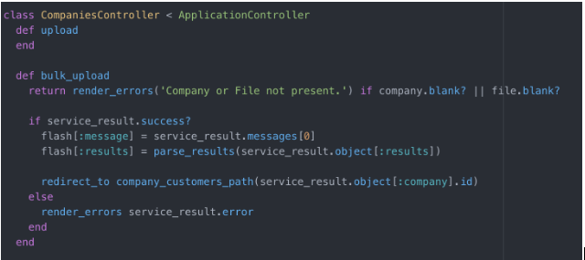
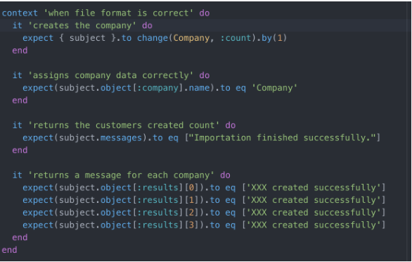

# CUSTOMER IMPORTER TOOL
- [CUSTOMER IMPORTER TOOL](#customer-importer-tool)
  * [Description](#description)
  * [Assumptions and Considerations](#assumptions-and-considerations)
  * [The Solution (Theoretical)](#the-solution--theoretical-)
  * [Thecnical Description](#technical-description)
    + [Technical Overview](#technical-overview)
    + [Revelant Gems](#revelant-gems)
    + [App and Running](#app-and-running)
    + [Tests and Testing Strategy](#tests-and-testing-strategy)
  * [Conclusion](#conclusion)
## Description

The Customer Importer Tool allows a company to import its customers to the system using a tabular file, like CSV or Excel formats.   
The main assumption behind that is when a company creates their account on the main system, one of the first things they'll need to do is to import their customers. This data usually comes from their CRM software, accounting software, old freight platform or some other place.  
The main system doesn’t care about which system the customers are being imported from is not that important because for the main app it will just be some kind of a tabular file, like an Excel file or a CSV file. 
 
## Assumptions and Considerations 

The project was thought considering the following assumptions: 

- What kind of data are we importing? 

- How to manage big data? (A file can contain 1000 of users as an example) 

- How to optimize the performance? 

- How to validate the data? 

- How to manage duplicate, wrong or corrupt data?  

- How to confirm the customers imported are valid or not? 

**1)** We are assuming the data we will import are from tabular files.  
Tabular files and spread sheets are divided in many formats. In our case we will import mainly CSV or Excel formats as mostly common used by legacy systems.  

**1.1)** The file we are going to import, contains the data we will use.  
In our specific case the file will contain on the very top of it, a row which contains the headers which will identify the data of the columns. Every row a part the top one identifies a customer which we want to import, and every customer is followed by some data. 
The data is showed in the following example of a spreadsheet: 
 
|customer_name   | address   | zip_code   |city    | country_name   | country_code   | user_email |
|---|---|---|---|---|---|---|
|  CompanyA  |somwhere    |  2500 |  CPH | Denmark   |DK   |some@rmail.com   |
| CompanyB  | B address   |  6000 |  Berslin | Germany   | DE  | de@email.com  | 

**1.2)** We have also to consider if data is correct inside the file and the validation of it. We need to regulate the import with some specific standards as for example during the import we can have some typos like a country_code can be small letter “dk” instead of “DK” or the country_name “denmark” instead of “Denmark”. We need somehow to care of those kinds of errors by the system so the data is corrected to the right format and added to the system.  

**2)** We need to assume a company has many customers. Like more than 1000. This means our spreadsheet will be very big and containing a lot of data. This quantity of data can affect the performance of our system and create troubles. The app can crash, doesn't import all data and has corrupted data. So, we need to pay attention about the data and the integrity of it.  

**3)** One important thing is to validate data. Our assumption is that the data could contain errors. There could be a situation where there are duplicates which are valid data. In our case we need to avoid having duplicates to not collect unnecessary data inside our system.   
The kind of duplicate we assume could be possible to encounter are as following: 

- Many entries for the same customer 

- Many entries for same email having different customers 

- One customer has many email addresses 

- Many same zips, cities etc...  

 
What we want to care about in the validation of duplicate is the principle of uniqueness. As an example, we assume same email cannot be used from many customers as in same email can be used for many customers. In this specific situation will assign the same user to all that customers. 

We also want to avoid importing the same customer many timesso if a customer is repeated we will update its information instead of creating a new

Customer with the same name. We decided that a customer is only managed by one user.

Doing in this way we avoid collecting data which will only damage our performance, space and integrity of the system. 

**4)** We assume that when the file is imported, and entries are generated for the customers. We need to confirm that data to be sure are correct and notify the customers about their new access to the system. We assume also those customers will began the use of our main app and they will need credentials to have the access. We could achieve that sending during the import an email to the customers, notifying them about they were added into the system and they need to confirm the data and proceed with the credential creation.   

## The Solution (Theoretical)  

The Customer Importer Tool was developed taking in mind as core functionalities to manage the data in the best way. An eye was dedicated to the import process and customer management. 
 
The import functionality allows a company to import essentially 3 formats: XLS, XSLX, and CSV. During the import, the system validates as first the file integrity and second the containing data. The validation of the data is an essential part and we are assuming there are two important fields to consider: costumer_name and user_email. This assumption comes from that thought: 

- We have customers which we want to confirm identity and to create a record of it. 

- We need to know who they are and where we want to send the confirmation. 

- Who they are   -> customer_name 

- Where to send -> user_email 

Assuming what above we have those two fields from the file which for us are vital. 
The reason is that without knowing who they are we are unable to create a record of them which has an identity and without where to send we cannot notify the customer to confirm the data.  
The feature takes care to check the file and report any error regarding the data missing. 

Another utility the import has is to check the data and how it is formatted. When the import starts it will check how the data is physically written. The validation will check essentially for text format mistake and convert them to a standard format. 
Essentially will care of the following: 

- If a country_name is written with a small letter as first like “denmark” the validation will change that to “Denmark”   

- If country_code is written like “de” will be changed to “DE” 

The validation of the duplicates also handed in thy process.  
We are validating in that way if the system detects as follows: 

- If we have the same customer with the same email the importer will record only one time that customer with that email 

- If we have one customer repeated but different emails, we are not adding the customers many times, but we are updating the user of the customer 

- If we have multiple customers having the same email, we do not import and raise an error for the specific entry 

One feature of the importer is that the valid data will be imported, and the wrong data will be notified. This to avoid the user to have an import fail for the entire file if some of the data is not correct but instead be notified what data is wrong so it will be able to correct and provide the correct data for the next import. This was assumed from the fact the company can upload a file containing thousands of customers and we need to have an optimized process also for the user part. So, the user will see what’s wrong and be able to correct but to not repeat the data which was imported successfully the first time.  
 
When the importer runs the validation, the data will be recorded. During this process, an automated process will start sending the email to the customer. A customer will receive a short message inviting to click a link to confirm its identity. The link will redirect to a secure page where the user must create and confirm a password and submit the confirmation. In this process, we don’t want to allow the customer to use a weak password like “1234” but instead, make it secure. 
We are allowing to make a password with the following criteria: 

- Min 8 char. 

- Min 1 uppercase letter 

- Min 1 special char. 

- Min 1 number.  

We want to assure security to our customer's data. 

During the validation process also, the email is checked to approve the validity of it.  

## Technical Description 

### Technical Overview
This is just a normal Rails app. To run it you just have to configure the database.yml config file, create and run de migrations. Not a mystery there!

The general concept of the app is to have stored information about companies which have customers which are linked to users. A user can be a customer of multiple companies.
A person in charge of a company has access to a tool (to a view) where a CSV or Excel file can be uploaded via a form and save all the information of the customers by just clicking a button!

So, in order to achieve this, we have 3 models in the database: Company, Customer and User.
A "company" has many "customers" (of course). A "customer" can only belong to one "company", but a "user" can use the services of many "companies", so that makes it a "customer" of each one.

The whole business logic of storing the data happens in the services. Two services were created: one which reads the document uploaded by the personal, makes all the corresponding controls, like checking that extension and correctness of the file, and a second one which is in charge of creating all the records on the database.
This later one also checks that the information on the uploaded file is correct. Otherwise the corresponding message will be shown to the person on the screen.

The app tries to save as much time as possible to the person uploading the data: if there is missing information on some customers, he will be informed, 
but all the others customers will be created, reporting which are the mistakes so they can be corrected and be re-uploaded.

If a customer is uploaded twice, that's fine! The service just ignore it and continues with the importation.

There were created only two controllers: the company controller and the customer controller. Very simple both of them.
The first one is the one that handles the form to upload the file and upload all the information. 
The second one is the one in charge of displaying all the information about the customers on the system.

When a user is created, an email is sent in order to confirm its user and create its own password. 
Once this is done, he can have access to the home page of the app, which is guarded by a user logged control (this was done using a before action with the helpers given by Devise).
The home page does not have much, just a link to the customers (all of them, so they can be listed and shown somewhere), a link to the edit profile page, and a log out button.

In the following image, the two public methods of the companies controller are shown:

In the following image, the main validations of the document importer are shown:

All very simple! The idea is just to use the different tools that the framework and its gems give to the developer.

All of this was coded following the style guides for Ruby and Rails which can be found in the following repositories:
https://github.com/rubocop-hq/ruby-style-guide
https://github.com/rubocop-hq/rails-style-guide

he Customer Importer Tool was developed using the following technologies:
- Ruby 2.5.3
- Rails 5.2.1
- PostgresSQL 11

### Revelant Gems
**Devise**: this gem manages the user creation and authentication. It also proves some features like confirmation and password recovery. Source: https://github.com/plataformatec/devise.

**Sidekiq:** this gem allows to process tasks in the background. We use it to send emails without blocking the main thread. Source: https://github.com/mperham/sidekiq.

**Bootstrap:** rails gem for Bootstrap framework. Source: https://github.com/twbs/bootstrap-rubygem

**jQuery-rails**: rails gem for jQuery framework. Source: https://github.com/rails/jquery-rails.

**Roo:** this gem implements read access for all common spreadsheet type. Source: https://github.com/roo-rb/roo.

**Rspec:** behaviour Driven Development for Ruby. Source: https://github.com/rspec/rspec.

### App and Running

1 - Run `bundle install`
2 - Run `rake db:create` (Database yml should be configure correctly)
3 - Run `rake db:migrate`
4 - Run `rails s`
5 - Open in the browser the following url: `http://localhost:3000`

### Tests and Testing Strategy 
Rspec is the tool we use for unit testing. We combine it we other gems such as Faker (https://github.com/stympy/faker) and Factory Bot (https://github.com/thoughtbot/factory_bot_rails) to achieve this tasks more efficiently.

RSpec is a great tool in the behavior-driven development (BDD) process of writing human readable specifications that direct and validate the development of your application.

Because of the time, we decided just to test the main part of the application so we tested the importer and a few others part of the application. For testing the importer we tested differents scenarios, for example:
- When file format is correct.
- When the company is not present.
- When the company is not present.
- When file format is wrong.
- When the input data is correct.
- When the user email is not present.
- When the company email is not present.

In the following image, a peace of the customer import service test is shown:

As an improvement, tests for the controllers and models must be added. 

Test results:

## Conclusion
The Customer Importer Tool was developed in two days. This project could easily take up to a week to do really awesome, production-ready implementation.  

What we have to consider for the future development is that this kind of tool should be developed/converted to a Gem. The reason is that this will be a part of a bigger system where many other functionalities are in place. So, ideally, that will be plugged into the system as a modular element. Used where need inside of a bigger app.

Something to consider, this app was not developed for the production and was only developed with core functionality to be extended. 

Some improvements to consider are that in a real app situation, the company which wants to use the tool will be logged into the system. Right now there is no login for this development purpose. The same situation for the customers imported. They should have a login system implemented and a profile page where to edit their data, change the password or something else. Also, some kind of customer filters could be added as well as pagination. Right now, users can see all customers but they should be able to see only the customers that they manage.

Right now, customers are just managed by one user, in the future, a possible change is to allow customers to be managed for more than one user. For this, a NxN relation has to be created instead of Nx1 relation.

At this time the app is not allowing to reset the password if a user will forget it, something to consider in the future. 

To optimize the performance in a better way, in the next development will be better to use a bulk insert way using a Gem called activerecord-import . This method can lower the code lines and speed up the performance drastically. If the csv is big, this action should be run in background and the user should be notified when the process finish. Also, for big files, a good idea will be to upload the file to amazon S3 and read it from there, instead of uploading in the form. 

From the management of the customers, the email sending can be taken from a background job which will increase the speed of the email sending. We also need to consider that sending like 1000 emails in the same time can provoke traffic issues and bottlenecks. The system can crash and the emails provider used to send can blacklist the sender.

 

 
 

 

 

 

 

 

 

 

 

 

